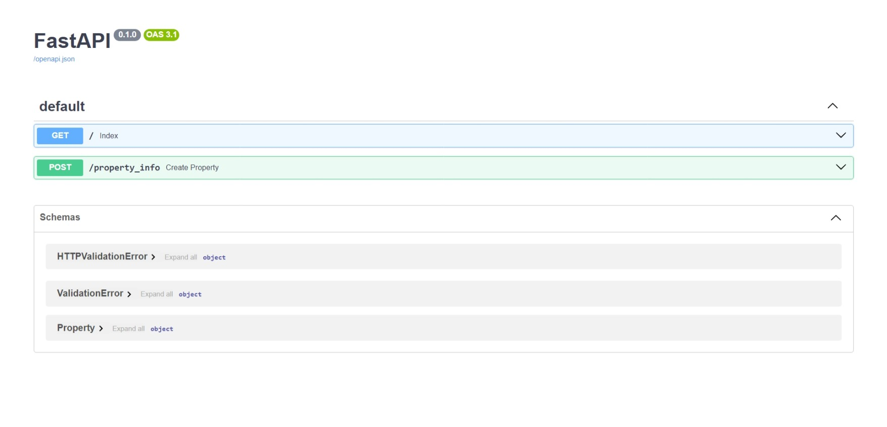
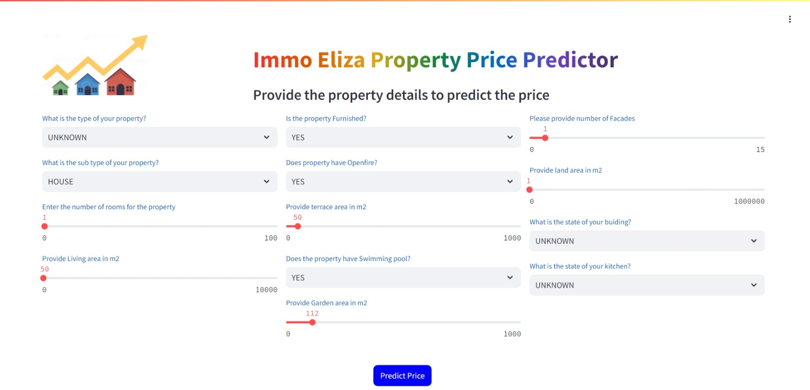

# Immo Eliza Price predictor
Immo Eliza price predictor is a web application deployed on streamlit. It allows the users who want to predict the property prices in Belgium based on their requirements.

## Usage
The project has two ways for accessing the price prediction
### Fast API Interface (Developers):
The project has an API interface which can be used by the developers to use.
[Here](https://immo-eliza-deployment-a02a.onrender.com/docs) is the link for accessing the API docs.
[](https://immo-eliza-deployment-a02a.onrender.com/docs)
### Streamlit webApp Interface
The project has a web GUI Interface for normal users to use.
[Here](https://adheeba-immo-eliza-deployment-streamlitstream-lit-nr8uqf.streamlit.app/) is the link for accessing the webapp created in streamlit

[](https://adheeba-immo-eliza-deployment-streamlitstream-lit-nr8uqf.streamlit.app/)
## Installation
The app can be directly used without any Installation by accessing the web version
The links for API and streamlit are given here:
1. [API](https://immo-eliza-deployment-a02a.onrender.com/docs)
2. [Streamlit](https://adheeba-immo-eliza-deployment-streamlitstream-lit-nr8uqf.streamlit.app/)

If you want to further develop on the code and try it by installing it locally. Follow the section below to install it locally in your machine.
### Installing in local machine
Following are the steps to install this project.
1. Download the github repo to your machine using the below command
    ```bash 
    git clone git@github.com:adheeba/immo-eliza-deployment.git
    ```
2. create a virtual environemnt using the following commands
    ```bash 
    virtualenv env
    ```
3. Activate the virtual environment. The command to activate virtual environment varies with OS
    Below is the command to activate it in windows
    ```bash
    .\env\Scripts\activate
    ```
4. Inside the virtual environmnet use the `requirements.txt` file inside this project to install dependencies
    ```bash
    pip install -r requirements.txt
    ```
Now you have all the setup to run this project.
### Run the project locally
1. Navigate to api directory inside the project and execute the below command to start fastapi
    ```bash
    uvicorn app:app --reload
    ```
2. Navigate to streamlit folder and run the below command to start streamlit.
    ```bash
    streamlit run stream_lit.py
    ```
## Contributors
The project is contributed by Adheeba Thahsin
## Timeline
The time line for this project is one week.